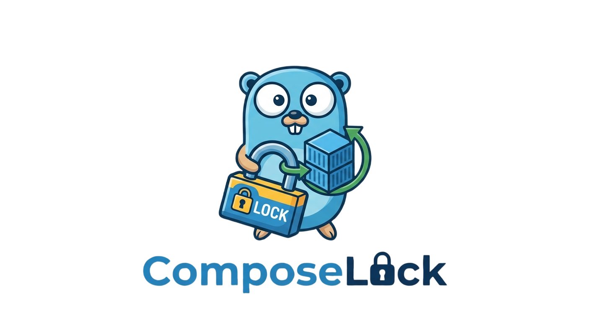

<p align="center">
  
</p>

# ComposeLock

[](https://github.com/teyhouse/ComposeLock/actions/workflows/ci.yml)
[](https://github.com/teyhouse/ComposeLock/releases/latest)
[](https://go.dev)
[](LICENSE)

ComposeLock is a small Go CLI that keeps a Docker Compose stack in sync
with a Git repository. It replaces manual `git pull && docker compose up`
or Portainer's GitOps stack sync with a version that will not apply a
change on top of a broken stack, and will not leave a broken change
running.

On each run it:

1. Fetches the configured Git branch and checks it against the local
   checkout.
2. Refuses to apply anything if the currently running stack is not
   healthy, or if the new commit already failed its health check once
   before.
3. Applies the new commit through the official Docker Compose SDK (no
   shelling out to `docker compose`).
4. Watches the result for a configurable window (default 5 minutes).
5. If the stack does not stay healthy for the full window, it reverts to
   the last commit that was known to be healthy and watches that too.

The Git checkout only moves once every pre-flight check has passed, so a
failed check (Docker unreachable, a missing `env_file`, an invalid
Compose file) is retried on the next run. Containers that exit with code
0, such as one-shot migration or init jobs, count as completed rather
than failed. Services removed from the Compose file are removed from the
stack.

State (last healthy commit, last failed commit, pending commit) is kept
in a JSON file next to the binary so a crash mid-deploy is recoverable on
the next run: an interrupted deploy is re-applied and watched again, and
an interrupted revert is finished.

Secrets are out of scope. ComposeLock will check that `env_file:` paths
referenced in the Compose file exist, but never opens, reads, or logs
them.

## Requirements

- Go 1.27 or newer to build.
- A reachable Docker daemon at runtime. The Compose SDK talks to it
  directly, so no `docker compose` CLI is required.
- `git` on `PATH`.

## Build

```sh
make build
```

Produces `bin/composelock`. Other targets:

```sh
make test     # go test -race -shuffle=on ./...
make smoke    # end-to-end run against the local Docker daemon
make lint     # go vet + staticcheck
make vuln     # govulncheck
make fmt      # gofmt
make install  # installs to /usr/local/bin
```

Cross-compile with `GOOS`/`GOARCH`, for example:

```sh
make build GOOS=linux GOARCH=amd64
```

## Configure

```sh
composelock --init --config composelock.json --with-state
```

This writes a default `composelock.json` and an empty `state.json`.
Config path resolution order: `--config` flag, then `$COMPOSELOCK_CONFIG`,
then `./composelock.json`.

Minimum fields to edit:

| Field           | Meaning                                    |
|-----------------|---------------------------------------------|
| `repo_path`     | Path to the local Git checkout               |
| `compose_file`  | Path to the `docker-compose.yml` to apply (or use `compose_dir` instead, see below) |
| `project_name`  | Compose project name (required by the SDK)   |

Everything else has a sane default:

| Field                          | Default              | Meaning                                        |
|---------------------------------|-----------------------|-------------------------------------------------|
| `remote`                        | `origin`              | Git remote to fetch                             |
| `branch`                        | `main`                | Branch to track                                 |
| `compose_dir`                   | (disabled)            | Directory of compose files; overrides `compose_file` when set, see below |
| `ssh_key`                       | (system agent)        | SSH key for Git, if not using the agent         |
| `state_file`                    | `./state.json`        | Where reconcile state is stored                 |
| `retry_attempts`                | `3`                   | Git fetch retry attempts                        |
| `retry_delay_seconds`           | `20`                  | Delay between Git retries                       |
| `poll_interval_seconds`         | `0`                   | Used only by `composelock poll`; `0` disables it |
| `health_watch_seconds`          | `300`                 | How long to watch after apply/revert            |
| `health_poll_interval_seconds`  | `5`                   | Poll interval during the health watch           |
| `health_unhealthy_streak`       | `3`                   | Consecutive unhealthy polls before failing      |
| `health_restart_tolerance`      | `1`                   | Restarts allowed before treating it as a failure |
| `discord_webhook`               | (disabled)            | Discord webhook URL for notifications           |
| `log_format`                    | `json`                | `json` or `text`, logged to stdout              |
| `pprof_listen`                  | (disabled)            | Loopback address for a pprof server in `poll`/`webhook` mode, e.g. `127.0.0.1:6060` |
| `webhook.listen`                | `127.0.0.1:8080`      | Address for `composelock webhook`               |
| `webhook.path`                  | `/webhook`            | Path for `composelock webhook`                  |
| `webhook.secret`                | (disabled)            | HMAC secret for the webhook; empty disables validation |

Every field can be overridden on the command line, run
`composelock --help` for the full flag list. Flags win over the config
file and are validated the same way. Duration flags must be whole
seconds (`30s`, `5m`).

The config file can hold `webhook.secret` and `discord_webhook`, so
`--init` creates it with mode `0600`.

### Multiple compose files (`compose_dir`)

Instead of one `compose_file`, point `compose_dir` at a directory of
compose files. When set, `compose_dir` takes precedence and `compose_file`
is ignored (a warning is logged if both are set).

Discovery rule: files directly inside `compose_dir` are merged into one
stack named `project_name`, the same way `docker compose -f a.yaml -f
b.yaml` merges multiple files into one project. Each immediate
subdirectory's files are merged into their own stack, named
`project_name-<subdirectory>`. Nesting deeper than one level is never
scanned. For example:

```
deployment/
├── service-a.yaml
├── service-b.yaml
├── service-c.yml
└── db/
    ├── docker-compose.yaml
    └── frontend-proxy.yaml
```

produces two stacks: `project_name` (service-a/b/c merged as one project)
and `project_name-db`.

A relative `compose_dir` is resolved against `repo_path`, so
`"compose_dir": "deployment"` means `<repo_path>/deployment` regardless of
which directory ComposeLock is started from.

Which files are picked up:

- Only `*.yaml` and `*.yml`, and only at depth 0 or 1. Dot entries are
  skipped, so pointing `compose_dir` at a repository root does not turn
  `.github/dependabot.yml` into a stack.
- A YAML file whose top level is not Compose Spec shaped (it has no
  `services:` or `include:`, and holds keys the spec does not define) is
  some other tool's config file sitting next to a compose file, such as a
  `prometheus.yml`. It is skipped, not merged, and does not fail the sync.
  Empty files are skipped too.
- Every remaining file is schema-validated on its own, before merging, so a
  file that is meant to be a compose file but is broken fails loudly with
  its own file name in the error instead of a generic merged-load failure.
  Unparsable YAML fails the same way.
- Two subdirectory names that normalize to the same project name (`my db`
  and `my-db`) are rejected with an error, because Compose would otherwise
  treat both as one project and remove the other's containers.

Before anything is touched, the pre-flight gate snapshots every stack that
is currently deployed, not just `project_name`, so a broken sub-stack stops
a new commit from being applied on top of it.

Only the stack(s) whose files actually changed in a commit are applied and
health-watched, the same skip logic described above for a single
`compose_file`, generalized per stack. A change to any `*.yaml` or `*.yml`
at depth 0 or 1 counts as a change to that directory's stack, including a
file the commit deleted. The changed stacks are health-watched
concurrently, so a cycle costs about one watch window no matter how many
stacks changed, and the first stack to fail stops the others rather than
delaying the rollback until their windows expire.

If a stack's health watch fails, only the stack(s) touched in that cycle
revert; a stack untouched this cycle is never affected by another stack's
failure. The revert re-applies each stack from the rollback target's own
file list, and a stack that only exists in the failing commit is torn down,
so the deployment ends up as the rollback target describes it.

A subdirectory removed entirely has its stack torn down, but only once the
cycle it was removed in is known to be healthy: if that cycle reverts, the
rollback target still describes the stack and its containers stay up.

## Commands

| Command    | Description                                                    |
|------------|------------------------------------------------------------------|
| `sync`     | One reconcile: fetch, gate, apply, watch, revert if needed       |
| `check`    | Same as `sync` but dry run: reports what would change, no writes |
| `status`   | Prints config path, state file contents, live container health  |
| `init`     | Scaffolds a default config (and state file with `--with-state`) |
| `poll`     | Runs `sync` in a loop every `poll_interval_seconds`              |
| `webhook`  | Starts an HTTP server that triggers `sync` on a Git push event  |
| `version`  | Prints version, commit, and build date                          |

Bare `composelock` with no command is equivalent to `sync`. `--version`
is also accepted as a flag and does the same as the `version` command.

### Exit codes

| Code | Meaning                                                       |
|------|-----------------------------------------------------------------|
| 0    | Success, nothing to do, or a known-bad commit was skipped     |
| 1    | Reconcile failed, but a revert brought the stack back healthy |
| 2    | Invalid usage or configuration                                |
| 3    | DEGRADED: revert also failed, manual intervention required    |

Once a run exits with code 3, every following run refuses to touch the
stack until it is retried with `--force`.

## Running as a cron job

`composelock sync` is a single, self-contained reconcile and is meant to
be invoked repeatedly, either by `composelock poll` as a long-running
process, or by cron. Use cron if you do not want a supervised background
process; use `poll` if you are already running this under systemd or a
similar supervisor.

A typical crontab entry, running every 5 minutes:

```
*/5 * * * * /usr/local/bin/composelock --config /etc/composelock/composelock.json sync >> /var/log/composelock.log 2>&1
```

Notes for cron specifically:

- Use absolute paths for the binary, `--config`, and every path inside
  the config file. Cron runs with a minimal environment and an
  unpredictable working directory.
- The user cron runs as needs permission to reach the Docker socket
  (usually membership in the `docker` group).
- `composelock` writes structured logs to stdout; redirecting them to a
  file, as above, is the simplest way to keep a record. `log_format` can
  be set to `text` if you prefer to read the log file directly instead of
  through a JSON log processor.
- Exit codes are meaningful for alerting. A wrapper script that checks
  `$?` after cron runs it, or cron's own `MAILTO`, is enough to get
  notified on exit codes 1 and 3. Discord notifications
  (`discord_webhook` in the config) cover the same cases without needing
  to parse cron output at all.
- Do not run `composelock poll` from cron. `poll` is a long-running loop
  and will simply pile up one process per cron tick.

## Run as a container

The published image bundles the binary and `git`; it talks to the
host's Docker daemon over the mounted socket, so no `docker`/`docker
compose` CLI, and no `git` on the host, is needed. `repo_path` must
already be a cloned checkout. ComposeLock never clones on its own,
so clone once using the image's own `git` before the first run:

```sh
docker run --rm \
  -v /share/CACHEDEV1_DATA/composelock:/share/CACHEDEV1_DATA/composelock \
  --entrypoint git ghcr.io/teyhouse/composelock:latest \
  clone <repo-url> /share/CACHEDEV1_DATA/composelock/repo
```

Then run ComposeLock itself:

```sh
docker run -d --name composelock \
  -v /var/run/docker.sock:/var/run/docker.sock \
  -v /share/CACHEDEV1_DATA/composelock:/share/CACHEDEV1_DATA/composelock \
  ghcr.io/teyhouse/composelock:latest \
  --config /share/CACHEDEV1_DATA/composelock/composelock.json poll
```

That one bind mount holds the repo checkout, `composelock.json`, and
`state.json`, at the same path inside the container as on the host
required so bind-mount paths inside the target `docker-compose.yml`
still resolve correctly, since the host daemon (not this container)
creates those containers. Every tagged release publishes this image;
build it locally instead with `make image`.

### `env_file:` paths outside the mounted directory

If a service in the target compose file has an `env_file:` pointing
somewhere other than inside the mounted data directory, mount that path
too, at the identical location. `CheckEnvFiles` and the Compose SDK read
`env_file:` contents from inside this container, before anything talks
to the Docker daemon. A path that only exists on the host, unmounted,
fails with `env file ... not found` even though `ls` on the host finds
it fine. For example, if `docker-compose.yml` has:

```yaml
services:
  traefik:
    env_file:
      - /share/secrets/traefik.env
```

add a matching mount:

```sh
docker run -d --name composelock \
  -v /var/run/docker.sock:/var/run/docker.sock \
  -v /share/CACHEDEV1_DATA/composelock:/share/CACHEDEV1_DATA/composelock \
  -v /share/secrets/traefik.env:/share/secrets/traefik.env:ro \
  ghcr.io/teyhouse/composelock:latest \
  --config /share/CACHEDEV1_DATA/composelock/composelock.json poll
```

## Smoke test

`make smoke` runs the real binary end to end against the local Docker
daemon. It creates a throwaway Git origin and a two-service stack
(project `composelock-smoke`, image `alpine:3.22`), then deploys, crashes
and reverts, skips the known-bad commit, trips the `env_file` check,
fails a Git fetch, and ends DEGRADED. The containers and the work
directory are removed afterwards.

To check Discord notifications as well, pass a webhook through the
environment. It is only written into the generated config file, never
into the repository:

```sh
COMPOSELOCK_SMOKE_DISCORD_WEBHOOK='https://discord.com/api/webhooks/...' make smoke
```

Six notifications arrive: deployed, reverted, `env_file` failure,
deployed, git sync failed, DEGRADED. Set `SMOKE_KEEP=1` to keep the work
directory and its logs.

`make smoke-compose-dir` covers `compose_dir` mode the same way: three
independent stacks (root, `db/`, `c/`), a change touching only one stack
(confirms the others are never recreated), a stack that crashes and
reverts (confirms unrelated stacks stay untouched), an invalid file added
anywhere in `compose_dir` (confirms the whole cycle fails loudly before
touching Docker), a subdirectory removed entirely (confirms its stack is
torn down via `Down` and that the commit is still recorded as the new
rollback target), a non-compose YAML file next to a compose file (confirms
it is skipped rather than failing the sync), and a compose file added to an
existing stack that then crashes (confirms the revert re-applies that stack
from the rollback target's file list instead of going DEGRADED). Same
`SMOKE_KEEP`/`SMOKE_WORKDIR` knobs apply.

## Versioning

ComposeLock follows [Semantic Versioning](https://semver.org). It is
currently `0.y.z`: the config format, CLI flags, and state file layout
may still change without a major bump.

The `VERSION` file at the repository root always holds the version that
will be used for the *next* release, for example `0.1.1`. Nobody needs to
touch it for routine changes: every release workflow run tags and
publishes exactly what is in `VERSION`, then increments the patch number
and commits `VERSION` back to `main` for next time. Patch releases are
therefore fully automatic.

Bump `VERSION` by hand only when a change is significant enough to
deserve a new major or minor line, a breaking config or CLI change, for
instance. Set it to whatever should be released next (`0.2.0`, `1.0.0`,
...) and commit it; the next relevant push releases exactly that version
and resumes auto-incrementing the patch from there.

Once the config format, CLI surface, and state file layout are
considered stable, bump `VERSION` to `1.0.0`.

## Continuous integration and releases

Every push to `main` that touches Go code (or `go.mod`/`go.sum`/the
`Makefile`) runs `go vet`, `staticcheck`, the full test suite
under the race detector, and `govulncheck`. Pull requests against
`main` run the same checks.

Releases are manual: trigger them via the **Run workflow** button on
the Release workflow, or push a version tag (e.g. `git tag v0.1.2 && git push origin v0.1.2`).
The Release workflow reads `VERSION`, builds a `linux/amd64` binary,
publishes a GitHub Release, builds and pushes the container image to
`ghcr.io/teyhouse/composelock` (tagged with the version and `latest`),
then bumps `VERSION` for the next patch.

See `.github/workflows/ci.yml` and `.github/workflows/release.yml`.

## License

See `LICENSE`.
